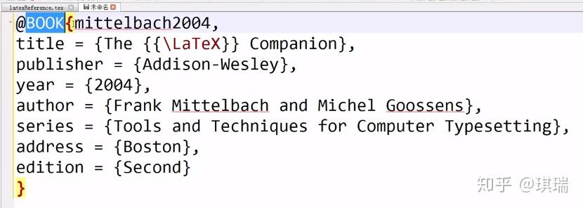

第十三个视频内容：参考文献BibTex

如部分文档：

\begin{document}
	\maketitle%使得导言区的设置生效
	引用一篇文章\cite{article1},引用一本书\cite{book1}
	\begin{thebibliography}{99}
		\bibitem{article1}马化腾，雷军，李彦宏，张一鸣.\emph{基于LaTex的Web数学公式提取方法研究}[J].计算机科学.2014(06)
		\bibitem{book1}Andy H,Bob,Cat,\emph{what does the fox say}
	\end{thebibliography}	
\end{document}
一个更合理的方式是把参考文件单独处理：

在另一个文件中(记为cite1)编写参考文献，如下图： @Book表示参考的是一本书

把该文件保存为后缀名为.bib的格式，内容如下：

@BOOK{mittelbach2004,
title={腾讯传},
publisher={广东教育出版社},
year={2004},
author={Frank Mittelbach and Michel Goossens},
series={Tools and Techniques},
address={广东},
edition={First}
}
在原文中引用，

\begin{document}
\maketitle%使得导言区的设置生效
引用一篇文章\cite{article1},引用一本书\cite{book1}
\begin{thebibliography}{99}
\bibitem{article1}马化腾，雷军，李彦宏，张一鸣.\emph{基于LaTex的Web数学公式提取方法研究}[J].计算机科学.2014(06)
\bibitem{book1}Andy H,Bob,Cat,\emph{what does the fox say}
这是一个文献引用：\cite{mittelbach2004}
\bibliography{cite1}
\end{thebibliography}
\end{document}
